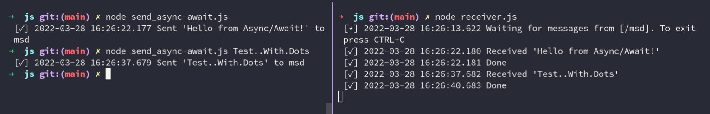
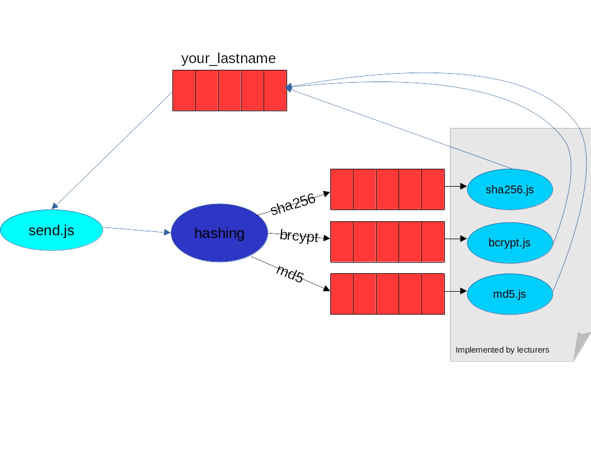

# Message Queuing Exercise - MSD20 SS22

In this exercise, we will learn how to interact with [RabbitMQ](https://www.rabbitmq.com/), an open source message broker.

You will work with *Queues*, *Exchange*, *Worker* (*Producer*) and *Consumer*.

The exercise is based on the [Tutorials](https://www.rabbitmq.com/getstarted.html) on rabbitmq.com. Some parts are already implemented and you should extend them.

> **CHECKPOINT**: You will find multiple **CHECKPOINTS** during this exercise. When you pass that checkpoint, ask your lecturer to check your steps to get points for grading.

## Prerequisites

For this exercise, you need:
* [Node.js](https://nodejs.org/en/)
  * `npm`
* Connection to FH-Network ([VPN](https://wissen.fh-joanneum.at/itservices/blog/2021/08/27/wie-kann-ich-meine-vpn-verbindung-einrichten/) or [FH WiFi](https://wissen.fh-joanneum.at/itservices/blog/2021/08/27/wie-kann-ich-eine-wlan-verbindung-einrichten/))

You will find on your VM (see [Webserver exercise](https://elearning.fh-joanneum.at/course/view.php?id=2772#section-5)) an running instance of RabbitMQ. If you want, you can [install it on your own](https://www.rabbitmq.com/download.html), but we will recommend to focus on the exercise, not the installation!

## Step 1 - Clone Repo and install dependencies
Clone this repo and install node dependencies.

```console
git clone git@git-iit.fh-joanneum.at:msd-webserv/ss22_techdemos/exercies/mq.git
cd mq
npm ci
```

## Step 2 - create a `.env` file
Copy the [`.env_EXAMPLE`](.env) to `.env` and add your custom configurations.

* `AMQP_HOST`: The IP of your VM (host, where RabbitMQ is running)
* `AMQP_USER` and `AMQP_PASS`: **msd**
* `AMQP_QUEUE`: <your lastname> (e.g. `schwab`)
* `AMQP_EXCHANGE`: <your lastname> (e.g. `schwab`)

> You will have to adapt this settings during the exercise!

Checkout [util/settings.js](util/settings.js) when you want more info about how it work.


## Step 3 - send and receive messages
To check if your environment is running, execute the [receiver.js](receiver.js) and one of the `send_*.js` scripts.



> **Why multiple send.js?**
> To work with RabbitMQ, we use the [amqplib](https://www.npmjs.com/package/amqplib) package, provided by RabbitMQ. The package provides a callback-based and a promise-based API. Therefore there are different ways to interact with RabbitMQ.  
> We provide 3 ways to interact with RabbitMQ, you can **CHOOSE** that your most familiar.
> * [send_callback.js](send_callback.js): Uses the callback-approach. You have to work with multiple levels of callback functions. The Rabbit-MQ Tutorials are using this approach.
> * [send_promise.js](send_promise.js): Uses [Promise](https://developer.mozilla.org/en-US/docs/Web/JavaScript/Reference/Global_Objects/Promise) to handle async calls. Instead of multiple levels of callbacks, you can use the `then`-chaining.
> * [send_asyn-await.js](send_async-await.js): Uses also the Promise based approach, but instead of chaining multiple `then`, we use the modern [`async/await`](https://developer.mozilla.org/en-US/docs/Web/JavaScript/Reference/Operators/await) syntax. When you're not familiar with callbacks or `then`, we recommend to use that code!

How to run them?
```console
$ node send_async-await.js
```

```console
$ node receiver.js
```

## Step 4 - RabbitMQ Tutorials

Start with the [Hello World](https://www.rabbitmq.com/tutorials/tutorial-one-javascript.html) Tutorial of RabbitMQ. You **do not have to implement** it on your own, simple follow the Tutorial and try to understand what the provided code does.

Instead of `'hello'`, your queue-name will be your last name! Also you don't connect to `localhost`, you will connect to your remote VM! The rest does the same.

Finished with "Hello World", you know the base concept of queues. Switch to the [Work queues](https://www.rabbitmq.com/tutorials/tutorial-two-javascript.html) Tutorial and check the description including **Round-robin dispatching**. Until this point our provided implementation is the same as in the online tutorial!

> **CHECKPOINT MQ-001: Create a document and add a screenshot showing two terminal windows. In one, run your preferred `send.js` and in the other run `receiver.js`. Send some messages with `send.js`.**


### Message acknowledgement, durability and fair dispatch

Follow the rest of the [Work queues](https://www.rabbitmq.com/tutorials/tutorial-two-javascript.html) tutorial and extend the `send.js` of your choice accordingly.

> **CHECKPOINT MQ-002: Extend your document and add the code-snippets, that you have added. Add also some screenshots showing that your extension work.**

### Publish/Subscribe

After you know how to work with single queues, it is time to learn about exchanges. Checkout the third tutorial [Publish/Subscribe](https://www.rabbitmq.com/tutorials/tutorial-three-javascript.html) and extend your code to work with a **fanout**-exchange.

Instead of hard-coding the exchange name, you can use `settings.amqp.exchange`, as long as you have set the `AMQP_EXCHANGE` in the [.env](.env) file.

> **CHECKPOINT MQ-003: Extend your document and add the code-snippets, that you have added. Add also some screenshots showing that your code works as expected.**


### Hashing Broker



On **10.77.23.68**, we provide a mq-broker that allows you to send messages to an exchange. Depending on a **routing-key**, that message will be hashed using a given hashing-algorithm ([MD5](https://en.wikipedia.org/wiki/MD5), [SHA256](https://en.wikipedia.org/wiki/Secure_Hash_Algorithms), [BCrypt](https://en.wikipedia.org/wiki/Bcrypt)).

Adapt your chosen `send.js` to send a Object to that Exchange.
That object should contain:
* **msg**: a "message" that should be hashed
* **queue**: a named queue (your lastname) where the hash will be returned

Example: 
```javascript
const obj = {
  msg: "Some message to be hashed",
  queue: "schwab"
};
```

Publish this object ([`JSON.stringify`](https://developer.mozilla.org/en-US/docs/Web/JavaScript/Reference/Global_Objects/JSON/stringify)) to the **direct**-Exchange **hashing**, using one of the following routing keys:
* md5
* sha256
* brcypt

Example:
```javascript
channel.publish('hashing', 'md5', Buffer.from(JSON.stringify(obj)));
```

Additionally, you consume the queue, given by the object. When you receive the hash, exit the send.js.

Example:
```javascript
channel.consume('schwab', (message) => {
  log.info(message.content.toString());
  process.exit(0);
}, {noAck: true});
```

> **CHECKPOINT MQ-004: Extend your document and add the code-snippets, that you have added. Add also some screenshots showing that your code works as expected.**
